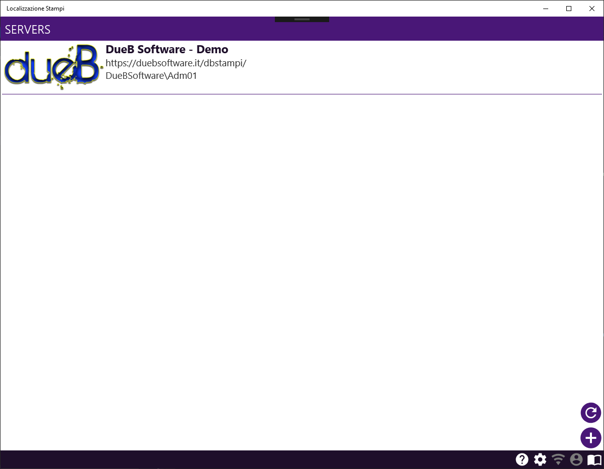
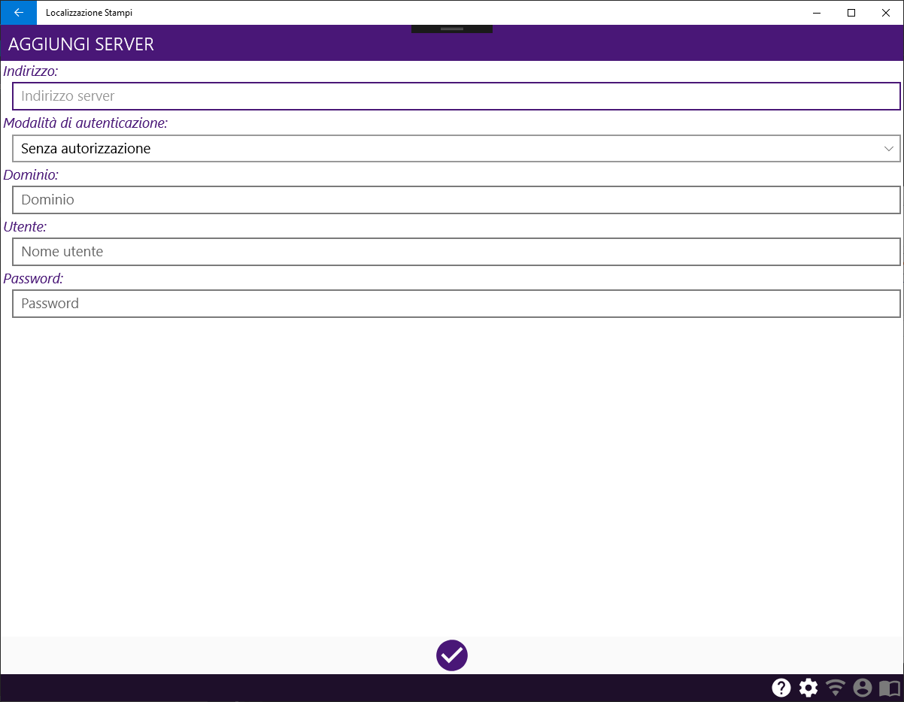
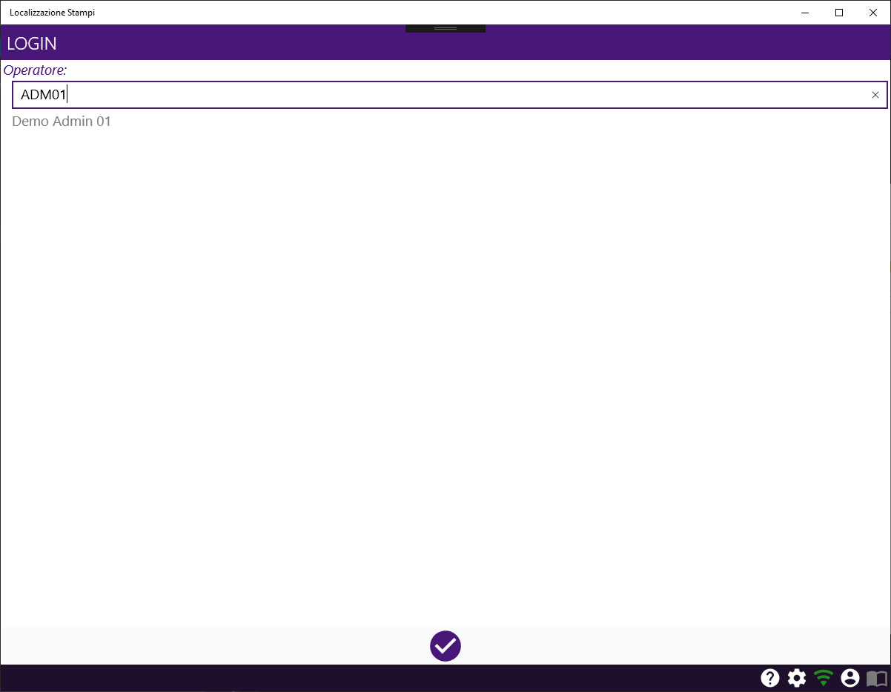
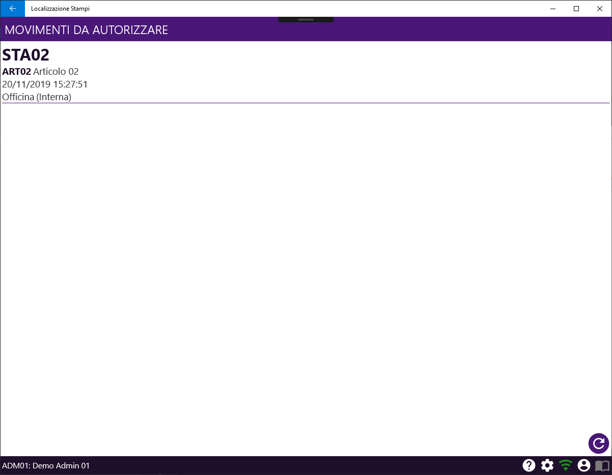
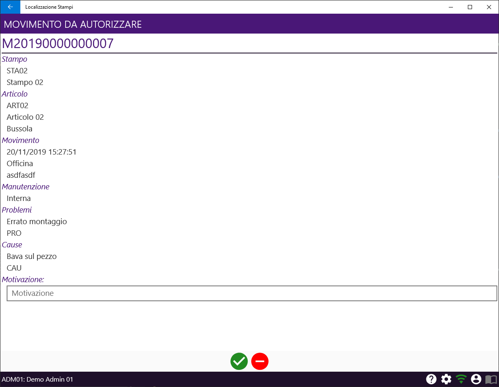

# DbStampi: Localizzazione Stampi (X-Platforms)

## Definizioni &amp; Caratteristiche del documento

Definizioni

Termine | Definizione 
--------- |----------
Barra di stato | La parte inferiore della pagina
Beta | Nome della versione di anteprima dell'applicazione
nd | Non disponibile

Le immagini delle pagine riportate all'interno del documento riguardano la versione desktop dell'applicazione.
La versione mobile differisce leggermente in qualche elemento, ma il layout e la disposizione dei comandi corrispondono alla versione desktop.

## Descrizione delle funzionalità
L'applicazione ha l'obiettivo primario di gestire e tracciare lo spostamento di uno stampo fra i reparti, consentendo una localizzazione in tempo reale dello stesso.
Per alcune movimentazioni è richiesta un'autorizzazione manuale, che può essere concessa (o negata) tramite un'apposita funzionalità dell'applicazione. 
Inoltre è possibile eseguire alcune operazioni di gestione del magazzino, come la variazione del deposito di riferimento di uno stampo.

Attualmente è presente una singola funzionalità:

- Autorizzazione movimento

Mentre sono in sviluppo le funzionalità:

- Movimentazione stampo
- Cambio deposito di riferimento

Ogni funzionalità presenta delle fasi comuni e delle fasi specifiche.
Le fasi comuni sono:

- [Connessione](#connessione)
- [Autenticazione operatore](#autenticazione-operatore)
 
Le fasi specifiche sono:

- Movimentazione stampo
    - ... In sviluppo ...

- Autorizzazione movimento
    - Selezione movimento da autorizzare
    - Autorizzazione movimento

- Cambio deposito di riferimento
    - ... In sviluppo ...

Ogni fase è caratterizzata da una o più pagine. 
Ogni pagina si divide fra un’area comune, definita barra di stato e posta nella parte inferiore della pagina, ed un’area personalizzata che comprende gli Input/Output della fase.

Le pagine si suddividono in diverse tipologie, che definiscono il layout generale della pagina. Pagine della stessa tipologia condividono quindi un layout simile ma presentano Input/Output differenti. 

Tipologie di pagine

Tipologia | Descrizione | Differenza desktop/mobile
--------- | ----------- | -------------------------
Elenco | Pagina che presenta solamente un elenco in cui è possibile selezionare un elemento.  Può essere dotata di barra di ricerca attraverso la quale è possibile filtrare l'elenco. | - Nelle pagine mobile è possibile aggiornare la lista con la modalità pull-to-refresh, mentre nelle pagine desktop è possibile aggiornare l'elenco con l'apposito comando o con il tasto funzione F5.  - Il menu contestuale su mobile si apre tenendo premuto sull'elemento, mentre su desktop si apre con un click del tasto destro del mouse.
Conferma | Pagina che presenta elementi di Input/Output generici e richiede una conferma.  Può essere dotata di molteplici comandi di conferma. | nd

### Barra di stato

La barra di stato è posizionata nella parte inferiore nella pagina, ed è comune a tutte le fasi. 

In seguito al processo di autenticazione vengono mostrati il codice ed il nome dell'operatore nella parte sinistra della barra. Nella parte destra invece sono presenti i comandi comuni, e sono abilitati solamente quelli eseguibili all'interno della pagina.

Comandi barra di stato

Comando | Descrizione
------- | -----------
[Suggerimenti](#suggerimenti) | Apre la visualizzazione dei suggerimenti della pagina
[Impostazioni](#impostazioni) | Apre la pagina che consente di modificare le impostazioni
[Gestione connessione](#gestione-connessione) | Apre i dettagli della connessione, e consente la disconessione dal server  L'icona è verde in presenza di connessione, rosso in assenza
[Assistenza](#assistenza) | Apre la pagina di richiesta assistenza
[Manuale utente](#manuale-utente) | Apre il manuale utente al capitolo relativo alla pagina aperta

#### Suggerimenti
Ogni pagina consente di visualizzare i suggerimenti per l'utilizzo della stessa, che vengono mostrati in una finestra di dialogo utilizzando l'apposito comando.

#### Impostazioni

Impostazioni

Impostazione | Descrizione
------------ | -----------
Disconnessione | Se abilitato, consente di eseguire il comando di disconnessione dal server corrente
Manuale utente  | Se abilitato, consente di aprire il manuale utente
Server di default | Indica il server con cui ci si collega direttamente all'avvio dell'applicazione, senza passare dalla pagina di selezione server

E' possibile proteggere le impostazioni con una password. In caso di impostazioni protette, all'apertura della pagina verrà richiesta la password.

#### Gestione connessione
E' possibile visualizzare i dettagli della connessione al server corrente. Inoltre, se abilitato dalle impostazioni, è possibile eseguire la disconnessione e tornare alla pagina di selezione server.

#### Assistenza
La richiesta di assistenza è disponibile solo in seguito all'avvenuta connesione. 
E' necessario identificare l'operatore che richiede assistenza, quindi bisogna inserire il codice personale qualora il processo di autenticazione non sia ancora concluso.

#### Manuale utente
E' possibile visualizzare il manuale utente (questo documento) all'interno dell'applicazione. 
La visualizzazione del manuale inizierà dal capitolo relativo alla pagina aperta.

### Scelta rapida
Nella versione desktop alcuni comandi sono eseguibili attraverso dei tasti di scelta rapida, che possono essere o dei tasti funzione o dei tasti chiave.

Tasti funzione

Tasto funzione | Comando | Descrizione
-------------- | ------- | -----------
F1 | Suggerimenti | Apre la visualizzazione dei suggerimenti della pagina
F2 | Impostazioni | Apre la pagina che consente di modificare le impostazioni
F3 | Connessione | Apre i dettagli della connessione, e consente la disconessione dal server
F4 | Assistenza | Apre la pagina di richiesta assistenza
F5 | Aggiorna lista | Ricarica l'elenco
F12 | Manuale utente | Apre il manuale utente al capitolo relativo alla pagina aperta

Tasti chiave

Tasto chiave | Comando | Descrizione
------------ | ------- | -----------
ESC | Esci (Finestra di dialogo) | Chiude la finestra di dialogo
ESC | Torna indietro (Pagina) | Torna alla pagina precedente
INVIO | Esegui | Esegue il comando selezionato

## Fasi &amp; Pagine

### Connessione

Pagine

Pagina | Tipologia | Funzionalità
------ | --------- | ------------
[Seleziona server](#seleziona-server) | Elenco | Comune
[Aggiungi/Modifica server](#aggiungimodifica-server) | Conferma | Comune

#### Seleziona server

L'operatore deve selezionare un server al quale collegarsi. In caso non ci siano server o il server desiderato non è presente nell'elenco è possibile aggiungerne uno utilizzando il comando *Aggiungi server*.
L'elenco mette a disposizione un menù contestuale con il quale è possibile eseguire operazioni sull'elemento selezionato.

Menù contestuale

Comando | Descrizione
------- | -----------
Connetti | Esegue la connessione al server
Rimuovi | Rimuove il server dall'elenco (in seguito a ulteriore conferma)
Modifica | Apre la [pagina](#aggiungimodifica-server) di modifica del server

#### Aggiungi/Modifica server

L'operatore deve impostare i parametri di collegamento al server. Viene tentato un collegamento al server e la registrazione avviene solo se il tentativo di connessione va a buon fine.

Parametri

Parametro | Descrizione
--------- | -----------
Indirizzo | L'indirizzo del server.   Una volta confermato non è possibile modificarlo.
Modalità di autenticazione | La modalità con cui autenticarsi al server.   - *Senza autorizzazione:* Solo per server con autenticazione non richiesta   - *Windows:* Utilizza l'autentizazione integrata di Active Directory   - *Utente/Password:* Utilizza l'autenticazione basata su utente/password
Dominio |Il dominio di Active Directory.   Disponibile solo per autenticazione *Windows*.
Utente | Il nome utente
Password | La password

### Autenticazione operatore

Pagina | Tipologia | Funzionalità
------ | --------- | ------------
[Login](#login) | Conferma | Comune

#### Login

L’operatore deve identificarsi inserendo il proprio timbro personale. Se l’operatore non è abilitato ad utilizzare le funzionalità non gli è consentito proseguire ai passaggi successivi.

### Autorizzazione movimento

Pagina | Tipologia | Funzionalità
------ | --------- | ------------
[Seleziona movimento da autorizzare](#seleziona-movimento-da-autorizzare) | Elenco | Autorizzazione movimento
[Autorizza movimento](#autorizza-movimento) | Conferma | Autorizzazione movimento

#### Seleziona movimento da autorizzare

L'operatore deve selezionare il movimento da autorizzare.

#### Autorizza movimento

L'operatore può confermare o rifiutare l'autorizzazione al movimento. In caso l'autorizzazione venga rifiutata è obbligatorio inserire una motivazione.