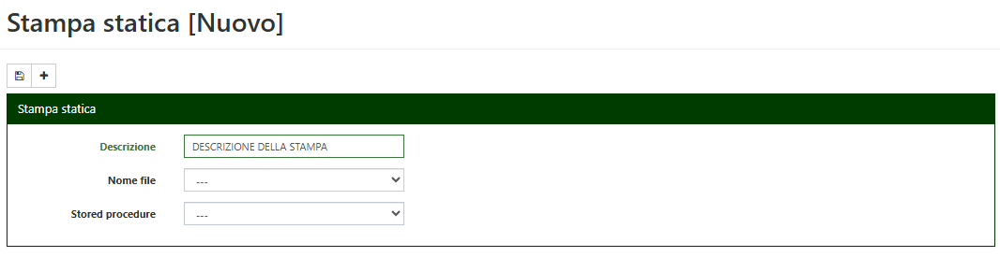

# DbStampi: Stampe statiche 

### Descrizione
Le stampe statiche sono immagini che possono essere stampate da *Localizazione Stampi* in fase di conferma movimento.  
I requisiti che le immagini devono rispettare sono:

- Essere in formato PNG 
- Avere le dimensioni di un documento in formato A4 

La condizione che determina se una stampa statica deve essere stampata o meno è ricavata da una stored procedure, che deve rispettare i seguenti requisiti: 

- Il nome deve iniziare per SS_ 
- Deve ricevere in input il numero del movimento (nvarchar, 15) 
- Deve restituire in output un valore booleano (bit 0=false, 1=true). Quando restituisce *true* bisogna eseguire la stampa 
 
Alla conferma del movimento viene eseguito il controllo delle stampe statiche censite chiamando l’apposita stored procedure. Se il controllo viene superato (la stored procedure restitusice *true*) la stampa viene aggiunta alla coda. 
Non è necessario che il movimento preveda una classica distinta (campionatura, officina, …), le stampe statiche possono essere 
generate per qualsiasi tipo di movimento. 

### Censimento nuova stampa
Per censire una nuova stampa statica bisogna seguire 3 passaggi: 

- Posizionare il file PNG nella cartella *Data/StaticPrints*
- Creare la stored procedure che serve a controllare la condizione 
- Censire la stampa tramite *DbManager* con la funzione *Strumenti/Stampe Statiche/Nuova*: 
	- Descrizione: Una semplice descrizione per riconoscere la stampa statica 
	- Nome file: Vengono proposti i file PNG presenti nell’apposita cartella  
	- Stored procedure: Vengono proposte le stored procedures utilizzabili 

